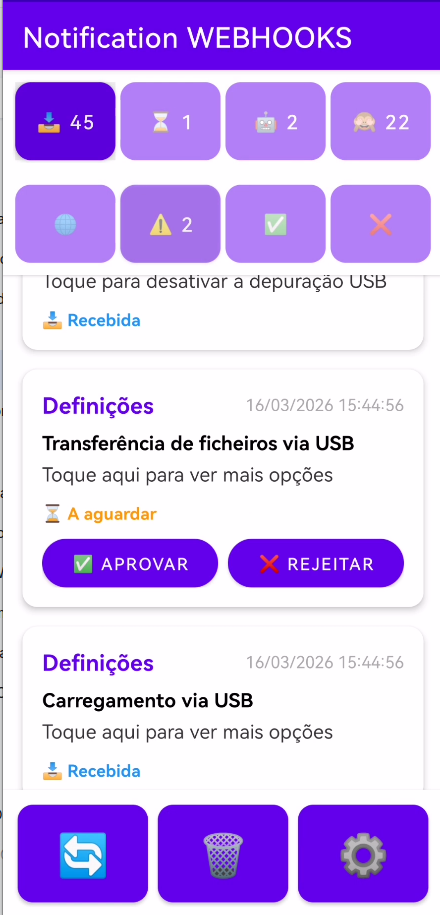
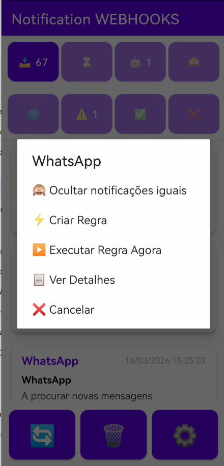
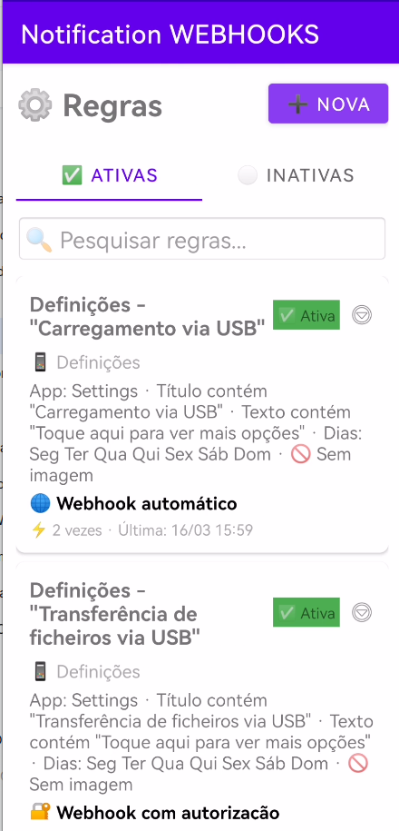
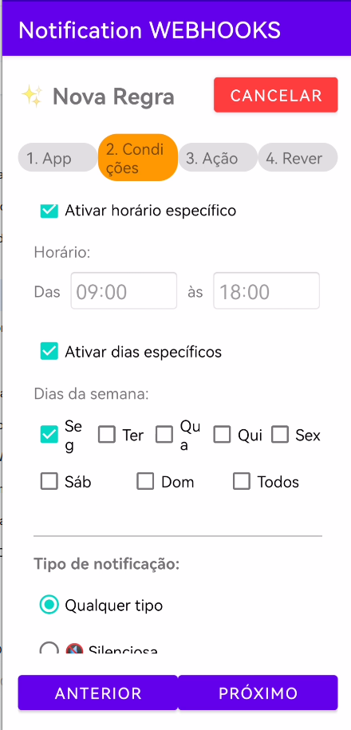
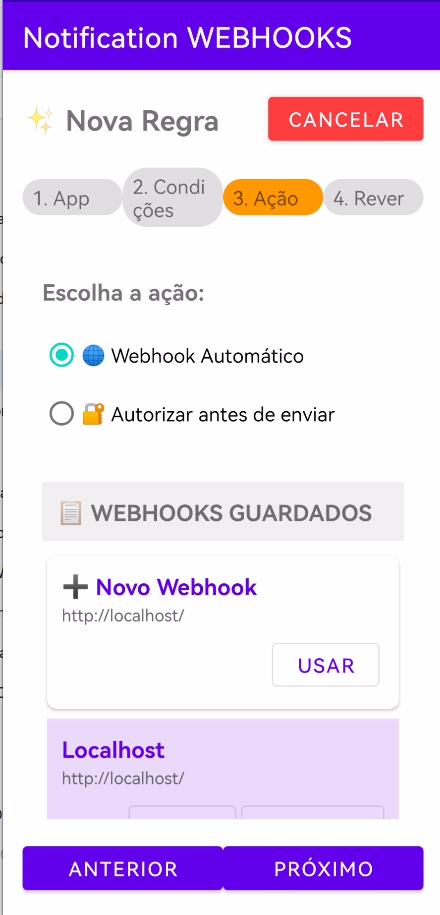

# 📱 Notification WEBHOOKS

**Notification WEBHOOKS** é uma aplicação Android de código aberto que permite encaminhar notificações do sistema para endpoints HTTP (webhooks) em tempo real. Automatize tarefas, integre com serviços externos e tome controlo das suas notificações.

---

## ✨ Funcionalidades

### 📥 Captura de Notificações
- Monitorização em tempo real de todas as notificações do sistema
- Extração inteligente de título e conteúdo
- Filtros visuais por status (Recebidas, Pendentes, Automáticas, Ocultas, etc.)

### ⚡ Regras Avançadas
- Criação de regras baseadas em:
  - Aplicação de origem
  - Conteúdo do título
  - Conteúdo do texto
  - Horário específico
  - Dias da semana
  - Tipo de notificação (silenciosa/alertante)
  - Presença de imagem

### 🌐 Gestão de Webhooks
- Múltiplos webhooks guardados
- Webhook fixo "Novo" com http://localhost/
- Teste de webhooks com requisição HEAD
- Suporte para payload personalizado

### 🔐 Segurança
- **HMAC-SHA256**: Assinatura de requests
- **Basic Auth**: Autenticação simples
- **Bearer Token**: Tokens JWT e similares
- **API Key**: Headers personalizados de autenticação

### 📋 Headers Avançados
- Headers personalizados em formato JSON
- Templates pré-definidos (n8n, Zapier, IFTTT, Home Assistant)
- Variáveis dinâmicas:
  - `{{notification.id}}`
  - `{{notification.title}}`
  - `{{notification.text}}`
  - `{{notification.package}}`
  - `{{rule.name}}`

### ⚙️ Configurações Avançadas
- Timeout configurável
- Número de tentativas (retries)
- Payload customizado
- Aguardar resposta do servidor (modo síncrono)

### 💾 Backup & Restore
- Exportar regras para ficheiro JSON
- Importar regras de backup
- Partilhado entre todas as regras

### 🌍 Internacionalização
- Português (PT)
- Inglês (EN)
- Fácil de adicionar novos idiomas

---

## 📸 Capturas de Ecrã

| Lista de Notificações | Menu de Contexto | Criação de Regras |
|----------------------|-------------------|-------------------|
|  |  |  |

| Passo 1 - App | Passo 2 - Condições | Passo 3 - Ação |
|---------------|---------------------|----------------|
|  |  |  |

---

❤️ Créditos

Desenvolvido por Nuno Monteiro (loqua.marketing) com o apoio do DeepSeek como parceiro de código.
Se gostas do projeto, considera fazer um donativo:

📞 Contacto

    GitHub: @loqua-marketing
    Issues: Repositório de issues
    E-mail: Relacionado com a app (loqua.marketing@gmail.comm) Assuntos comerciais: info@loqua.marketing
    Website: https://loqua.marketing
